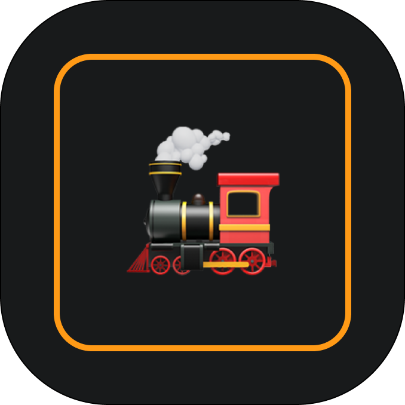

<p align="center">
  
</p>

# Loco 🚂 – Documentation‑Driven AI Development

> The future of AI‑assisted coding isn’t just faster code generation — it’s maintaining architectural coherence while coding at AI speed.

Loco is an offline‑first AI coding companion that embraces **Documentation‑Driven AI Development (DDAID)**: specialized tools and agents that keep living documentation in sync with your evolving codebase so both humans and AI stay aligned.

## Why

Modern AI can generate thousands of lines per hour, but humans can only understand hundreds. Without maintained shared context you get:
- Context drift: suggestions fight your patterns
- Knowledge loss: architectural decisions vanish
- Slower onboarding: newcomers can’t find the “why”
- Debt: fast code with fragile structure

## What Loco does

- Progressive analysis (Quick → Detailed → Deep) to build project knowledge
- Unified, permissioned tools (everything is a tool) for safe actions
- Beautiful TUI with live “tool cards” that show progress and results
- LM Studio integration (local models, streaming)
- Sessions and cached knowledge under `.loco/`

## Current status

- ✅ TUI with sidebar, live tool cards, status HUD
- ✅ Unified tool architecture with safe prompts/permissions
- ✅ LM Studio client with streaming; configurable context window
- ✅ Tiered analysis with caching
- 🚧 DDAID “sidecar” file‑watcher and incremental doc updates
- 🚧 Specialized agents producing/refining living docs

## Quick start

```bash
# 1) Prereqs: LM Studio running locally with a model loaded
#    Tip: choose a small code model first (e.g., Qwen2.5 Coder 7B)

# 2) Build and run
make build # or: go build && ./loco

# 3) Inside Loco
/analyze quick     # quick scan (then cascade if you like)
/help              # available commands

# You can press ESC anytime to interrupt a running tool
```

Config (optional): `.loco/config.json` lets you pin LM Studio URL and defaults. The app also sets safe defaults for context window (n_ctx) and num_keep to avoid model errors.

## Architecture (high‑level)

```
internal/
  app/       # Tool executor, services, command handling
  tui/       # Bubble Tea UI; chat view; tool cards; status + sidebar
  tools/     # Bash/view/edit/write/analyze/startup_scan (permissioned)
  analysis/  # Quick/Detailed/Deep tiers + caching + progress events
  llm/       # LM Studio client (Complete/Stream; n_ctx/num_keep)
  session/   # Conversation/session persistence
  config/    # Local-first config in .loco/
```

## Design principles

- Documentation as shared memory (DDAID)
- Tools all the way down (commands/agents/system events are tools)
- Local‑first, human‑in‑control (permissions + ESC interrupt)
- Tight feedback (live progress; no “frozen” UI)

## Contributing

We’re building for developers who care about architectural coherence with AI in the loop.

- Start with the docs in `docs/`
- Pick a piece that advances DDAID (sidecar, incremental knowledge, agents)
- Open an issue to align on approach, then PR

## Badge / Logo

We use a small train motif in the TUI. If you’d like to add a logo to the repo header, place a PNG at `docs/website/loco-logo.png` and reference it in your repo description/settings or embed it at the top of this README:

```

```

---

Loco explores the future of human‑AI collaborative development. 🚂