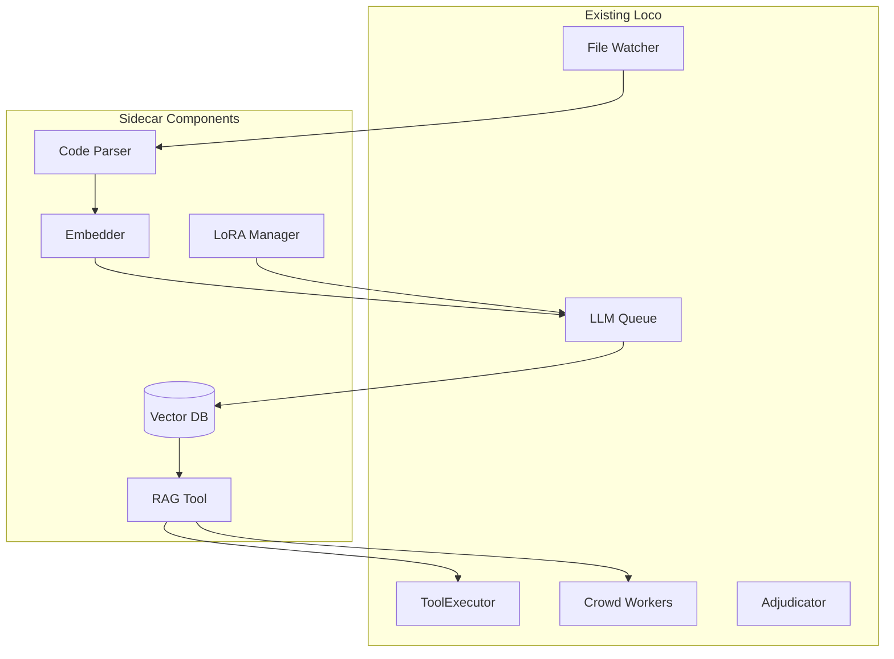

# Loco-Sidecar: RAG & LoRA Enhancement Plan

## Executive Summary

Loco-Sidecar extends your existing local AI coding companion with Retrieval-Augmented Generation (RAG) and LoRA fine-tuning capabilities, specifically designed for rapidly-evolving, LLM-generated codebases. This enhancement leverages your existing architecture while adding intelligent context retrieval and model specialization.

## 1. Architecture Design

### 1.1 Integration Overview



### 1.2 Component Integration Points

```go
// internal/sidecar/types.go
type SidecarService interface {
    // RAG operations
    UpdateEmbeddings(ctx context.Context, files []string) error
    QuerySimilar(ctx context.Context, query string, k int) ([]Document, error)
    
    // LoRA operations
    TrainAdapter(ctx context.Context, config TrainConfig) error
    LoadAdapter(ctx context.Context, modelName string) error
    
    // Lifecycle
    Start(ctx context.Context) error
    Stop() error
}

// Integrate as a tool
type ragTool struct {
    sidecar SidecarService
    analysisService analysis.Service
}

func (r *ragTool) Name() string { return "rag_query" }
```

### 1.3 Enhanced Crowd Pattern

The existing crowd + adjudicator pattern gets RAG context injection:

```go
// Enhanced worker prompt generation
func (s *startupScanTool) generateWorkerPrompt(ctx context.Context, fileList string) string {
    basePrompt := s.buildBasePrompt(fileList)
    
    // Inject RAG context
    if s.sidecar != nil {
        relevant, _ := s.sidecar.QuerySimilar(ctx, basePrompt, 5)
        if len(relevant) > 0 {
            basePrompt += "\n\nRelevant context from codebase:\n"
            for _, doc := range relevant {
                basePrompt += fmt.Sprintf("- %s: %s\n", doc.Path, doc.Summary)
            }
        }
    }
    
    return basePrompt
}
```

## 2. RAG Implementation Plan

### 2.1 Embedding Pipeline

```go
// internal/sidecar/embedder.go
type EmbeddingPipeline struct {
    watcher  *watcher.Watcher
    parser   *Parser
    embedder *LocalEmbedder
    vectorDB VectorStore
    queue    *llm.Queue
}

func (p *EmbeddingPipeline) ProcessFile(path string) error {
    // 1. Parse code structure
    ast, err := p.parser.ParseFile(path)
    if err != nil {
        return err
    }
    
    // 2. Generate chunks with context
    chunks := p.generateChunks(ast)
    
    // 3. Queue embedding requests
    for _, chunk := range chunks {
        p.queue.Enqueue(llm.Request{
            Type:     llm.EmbeddingRequest,
            Priority: llm.PriorityLow,
            Data:     chunk,
            Callback: func(embedding []float32) {
                p.vectorDB.Store(chunk.ID, embedding, chunk.Metadata)
            },
        })
    }
    
    return nil
}
```

### 2.2 Vector Storage Strategy

**Decision Matrix:**

| Storage | Pure Go | Performance | Persistence | Embedding Size Support |
|---------|---------|-------------|-------------|----------------------|
| SQLite + sqlite-vec | ❌ (CGO) | ⭐⭐⭐⭐ | ⭐⭐⭐⭐⭐ | ⭐⭐⭐⭐⭐ |
| BoltDB + custom index | ✅ | ⭐⭐⭐ | ⭐⭐⭐⭐⭐ | ⭐⭐⭐ |
| In-memory + disk cache | ✅ | ⭐⭐⭐⭐⭐ | ⭐⭐ | ⭐⭐⭐⭐ |
| Chroma (embedded) | ❌ | ⭐⭐⭐⭐ | ⭐⭐⭐⭐ | ⭐⭐⭐⭐⭐ |

**Recommendation:** Start with SQLite + sqlite-vec for v1, with interface to swap later:

```go
// internal/sidecar/vectordb/sqlite.go
type SQLiteVectorDB struct {
    db *sql.DB
}

func (v *SQLiteVectorDB) Initialize() error {
    schema := `
    CREATE TABLE IF NOT EXISTS embeddings (
        id TEXT PRIMARY KEY,
        path TEXT NOT NULL,
        chunk_index INTEGER,
        embedding BLOB,
        metadata JSON,
        updated_at TIMESTAMP DEFAULT CURRENT_TIMESTAMP
    );
    CREATE INDEX IF NOT EXISTS idx_path ON embeddings(path);
    `
    _, err := v.db.Exec(schema)
    return err
}
```

### 2.3 Prompt Augmentation Strategy

```go
// internal/sidecar/augmenter.go
type PromptAugmenter struct {
    vectorDB VectorStore
    tiers    map[analysis.Tier]AugmentConfig
}

type AugmentConfig struct {
    MaxContext   int  // tokens
    TopK         int  // similar documents
    IncludeAST   bool
    IncludeTests bool
}

var defaultConfigs = map[analysis.Tier]AugmentConfig{
    analysis.TierStartup: {MaxContext: 500, TopK: 3},
    analysis.TierQuick:   {MaxContext: 2000, TopK: 5},
    analysis.TierDetailed: {MaxContext: 8000, TopK: 10, IncludeAST: true},
    analysis.TierDeep:    {MaxContext: 16000, TopK: 20, IncludeAST: true, IncludeTests: true},
}
```

## 3. LoRA Training Pipeline

### 3.1 Training Data Generation

```go
// internal/sidecar/lora/dataset.go
type DatasetGenerator struct {
    parser   *ast.Parser
    analyzer *analysis.Service
}

func (g *DatasetGenerator) GenerateFromCodebase(dir string) (*Dataset, error) {
    samples := []TrainingSample{}
    
    // Generate instruction-following pairs
    err := filepath.Walk(dir, func(path string, info os.FileInfo, err error) error {
        if strings.HasSuffix(path, ".go") {
            // Extract functions with docs
            functions := g.parser.ExtractFunctions(path)
            for _, fn := range functions {
                samples = append(samples, TrainingSample{
                    Instruction: fmt.Sprintf("Explain the %s function", fn.Name),
                    Input:       fn.Signature,
                    Output:      fn.DocComment,
                })
            }
        }
        return nil
    })
    
    return &Dataset{Samples: samples}, err
}
```

### 3.2 Training Automation

```go
// internal/sidecar/lora/trainer.go
type LoRATrainer struct {
    schedule   string // "nightly", "on-change", "manual"
    threshold  int    // files changed before triggering
    lastTrain  time.Time
    dataset    *Dataset
}

func (t *LoRATrainer) ShouldTrain(filesChanged int) bool {
    switch t.schedule {
    case "nightly":
        return time.Since(t.lastTrain) > 24*time.Hour
    case "on-change":
        return filesChanged > t.threshold
    default:
        return false
    }
}

func (t *LoRATrainer) Train(ctx context.Context) error {
    // Generate JSONL training file
    trainFile := filepath.Join(".loco", "training", fmt.Sprintf("train_%d.jsonl", time.Now().Unix()))
    
    // Call external training script (Python/llama.cpp)
    cmd := exec.CommandContext(ctx, "python", "train_lora.py",
        "--model", "qwen2.5-coder:1.5b",
        "--data", trainFile,
        "--output", filepath.Join(".loco", "adapters"),
        "--rank", "16",
        "--alpha", "32",
        "--epochs", "3",
    )
    
    return cmd.Run()
}
```

## 4. Model Strategy & Routing

```go
// internal/sidecar/router.go
type ModelRouter struct {
    small  llm.Client // LoRA + RAG
    medium llm.Client // RAG only
    large  llm.Client // RAG only
}

type RouteDecision struct {
    Model    llm.Client
    UseLoRA  bool
    UseRAG   bool
    Reason   string
}

func (r *ModelRouter) Route(ctx context.Context, query string, complexity float64) RouteDecision {
    // Simple heuristic-based routing
    if complexity < 0.3 {
        return RouteDecision{
            Model:   r.small,
            UseLoRA: true,
            UseRAG:  true,
            Reason:  "Simple query - using fast small model with specialization",
        }
    } else if complexity < 0.7 {
        return RouteDecision{
            Model:   r.medium,
            UseLoRA: false,
            UseRAG:  true,
            Reason:  "Medium complexity - using medium model with context",
        }
    }
    
    return RouteDecision{
        Model:   r.large,
        UseLoRA: false,
        UseRAG:  true,
        Reason:  "Complex architectural query - using large model",
    }
}
```

## 5. Implementation Phases

### Phase 1: Basic RAG (Week 1-2)
- [ ] Create sidecar package structure
- [ ] Implement local embedder using sentence-transformers ONNX
- [ ] Basic vector similarity search in memory
- [ ] Hook into existing file watcher
- [ ] Create RAG tool for ToolExecutor

### Phase 2: Vector DB Integration (Week 3)
- [ ] SQLite + sqlite-vec setup
- [ ] Persistence layer
- [ ] Incremental updates
- [ ] Query optimization
- [ ] Metadata filtering

### Phase 3: First LoRA Training (Week 4-5)
- [ ] Dataset generation from Go code
- [ ] Training script wrapper
- [ ] LM Studio adapter loading
- [ ] A/B testing framework

### Phase 4: Automated Retraining (Week 6)
- [ ] Change detection thresholds
- [ ] Background training jobs
- [ ] Version management
- [ ] Rollback capability

### Phase 5: Smart Routing (Week 7-8)
- [ ] Complexity analysis
- [ ] Model selection logic
- [ ] Performance monitoring
- [ ] Adaptive thresholds

## 6. Go Implementation Details

### 6.1 Recommended Packages

```go
// go.mod additions
require (
    github.com/mattn/go-sqlite3 v1.14.22        // SQLite driver
    github.com/asg017/sqlite-vec-go v0.1.0      // Vector extension
    github.com/knights-analytics/hugot v0.1.0   // ONNX embeddings
    golang.org/x/tools v0.24.0                  // AST parsing
    github.com/schollz/progressbar/v3 v3.14.1   // Training progress
)
```

### 6.2 Embedding Generation

```go
// internal/sidecar/embedder/local.go
type LocalEmbedder struct {
    model *hugot.Model
}

func NewLocalEmbedder() (*LocalEmbedder, error) {
    // Use all-MiniLM-L6-v2 ONNX model
    model, err := hugot.NewModel(
        "sentence-transformers/all-MiniLM-L6-v2",
        hugot.WithONNX(),
        hugot.WithDevice("cpu"),
    )
    return &LocalEmbedder{model: model}, err
}

func (e *LocalEmbedder) Embed(text string) ([]float32, error) {
    return e.model.Encode([]string{text})
}
```

## 7. Performance Targets

| Metric | Target | Measurement Method |
|--------|--------|-------------------|
| File change → embedding update | <100ms | Time from fsnotify event to DB write |
| RAG query latency (small model) | <1s | 95th percentile response time |
| LoRA training time | 1-3 hours | Full dataset on RTX 3060 |
| Vector DB query (10k docs) | <50ms | Index lookup + similarity |
| Memory usage (100k embeddings) | <2GB | RSS with full index loaded |

## 8. Configuration Schema

```yaml
# .loco/config.yaml
sidecar:
  enabled: true
  
  rag:
    enabled: true
    embedding_model: "all-MiniLM-L6-v2"
    vector_db: "sqlite"
    update_strategy: "incremental"
    chunk_size: 512
    chunk_overlap: 128
    max_context_tokens: 8000
    
  lora:
    enabled: true
    auto_train: true
    schedule: "nightly"  # nightly, on-change, manual
    change_threshold: 100  # files changed
    base_model: "qwen2.5-coder:1.5b"
    rank: 16
    alpha: 32
    epochs: 3
    batch_size: 4
    
  routing:
    complexity_threshold_small: 0.3
    complexity_threshold_medium: 0.7
    prefer_specialized: true
```

## 9. Testing Strategy

```go
// internal/sidecar/rag_test.go
func TestRAGRetrieval(t *testing.T) {
    tests := []struct {
        name      string
        query     string
        expected  []string // expected file paths in results
        minScore  float32
    }{
        {
            name:     "finds_related_functions",
            query:    "startup scan consensus",
            expected: []string{"startup_scan.go", "consensus_ranking.go"},
            minScore: 0.7,
        },
    }
    // ...
}

// internal/sidecar/lora_test.go
func TestLoRAEffectiveness(t *testing.T) {
    baseline := evaluateModel(t, "base_model", testQueries)
    withLoRA := evaluateModel(t, "base_model+lora", testQueries)
    
    improvement := (withLoRA.Score - baseline.Score) / baseline.Score
    assert.Greater(t, improvement, 0.15) // Expect 15% improvement
}
```

## 10. Risk Assessment & Mitigation

| Risk | Impact | Likelihood | Mitigation |
|------|--------|------------|------------|
| Embedding model too slow | High | Medium | Cache aggressively, batch operations |
| LoRA training corrupts model | High | Low | Version control, automatic validation |
| Vector DB grows too large | Medium | High | Implement pruning, compression |
| RAG returns irrelevant context | High | Medium | Tune similarity thresholds, add reranking |
| LM Studio doesn't support LoRA | High | Low | Fallback to base model, consider llama.cpp |

## Implementation Checklist

### Immediate Actions (Week 1)
- [ ] Create `internal/sidecar` package structure
- [ ] Define core interfaces (VectorStore, Embedder, Trainer)
- [ ] Set up SQLite with vector extension
- [ ] Implement basic file → embedding pipeline
- [ ] Add `sidecar` configuration section

### Quick Wins (Week 2)
- [ ] Hook into existing file watcher
- [ ] Create simple RAG tool
- [ ] Add embedding cache
- [ ] Basic similarity search
- [ ] Integration tests

### Core Features (Week 3-4)
- [ ] AST-based chunking
- [ ] Metadata extraction
- [ ] LoRA dataset generation
- [ ] Training script wrapper
- [ ] Model router implementation

### Advanced Features (Week 5-8)
- [ ] Incremental embedding updates
- [ ] Automatic retraining triggers
- [ ] A/B testing framework
- [ ] Performance monitoring
- [ ] Adaptive routing

## Conclusion

This plan leverages Loco's existing strengths while adding powerful RAG and LoRA capabilities specifically designed for LLM-speed development. The phased approach allows for quick wins while building toward a sophisticated, self-improving system that learns from your rapidly-evolving codebase.